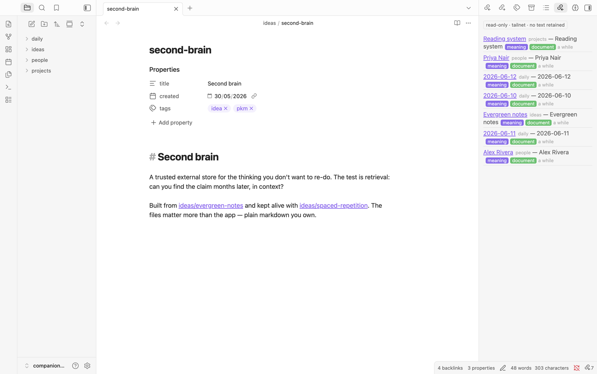
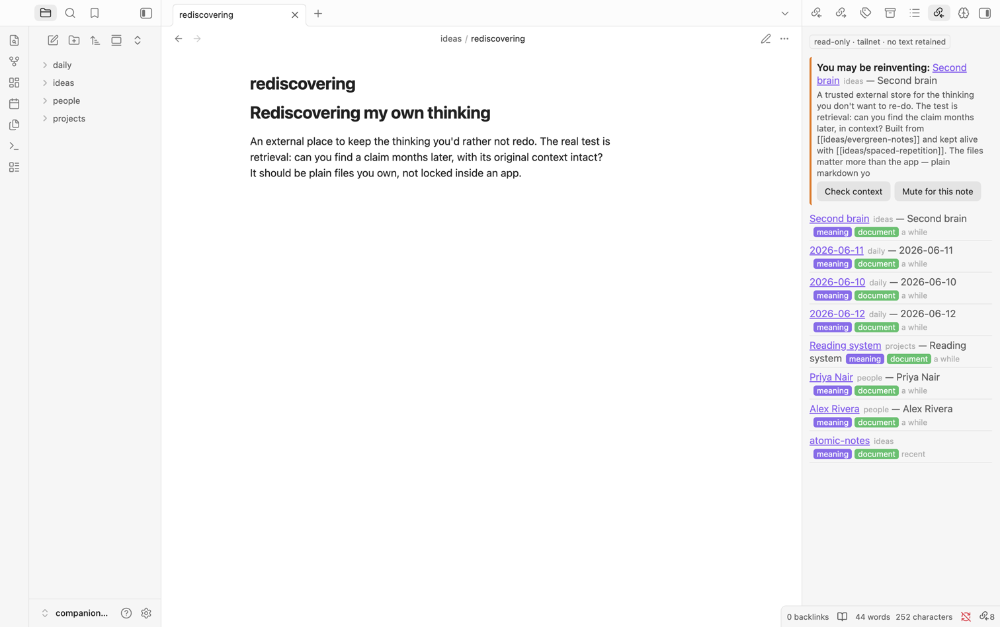

# Hypermnesic Companion (Obsidian plugin)

Surface read-only, pause-triggered related notes and an interrogable reinvention
nudge from your tailnet **hypermnesic** index as you write — a calm, **desktop**
recall surface that **never writes your vault**.

<!-- TODO(LS-1782): add docs/media/demo.gif (pause-triggered status-bar recall popover) as the top hero once recorded. -->


## What it does

- **Pause-triggered** recall (never per-keystroke) of the block around your
  cursor — findings hold while you keep typing and refresh when you pause.
- A calm **status-bar** indicator that expands to a popover; an **opt-in
  sidebar**; an optional editor inline marker.
- **First-class references everywhere**: every related note is a native
  `internal-link` with **Page-preview on hover** and a right-click menu (open /
  open in new pane or split / think about this / copy as link), plus
  drag-to-insert — all **read-only** (the plugin supplies link text; you perform
  the drop/paste). A note that isn't in your vault renders as an honest muted row
  with an engine-snippet peek — never a broken or note-creating link.
- **Thinking-mode** is a **dockable panel** (like Backlinks/Outline): related
  notes (navigable), Socratic questions, and tensions (rendered markdown with
  live, resolution-guarded links), a "think deeper" affordance with a back trail,
  and a visible `wrote: false` badge. Plus **selection-recall** (recall about the
  highlighted text).
- An **interrogable reinvention nudge**: it expands to the matched snippet and a
  one-hop context peek so the claim is checkable, and it is mutable per note
  (view-only — muting is plugin-local and never edits the note).
- **Forgetting-curve ranking**: genuinely stale-but-relevant notes surface above
  ones you just touched.

## Screenshots

**Opt-in recall sidebar** — every related note is a first-class `internal-link`
(hover for page-preview, right-click for open / think / copy), with meaning + document
match chips. All read-only.



**Interrogable reinvention nudge** — "You may be reinventing…" expands to the matched
snippet and a context peek so the claim is *checkable*, and it's mutable per note
(view-only — muting never edits the note).



> Screenshots are captured against a disposable demo vault. The companion shows only the
> placeholder `tailnet` endpoint and retains no note text.

## Read-only by construction

This plugin **never writes the vault**. Every engine call routes through a hard
allowlist (`src/core.ts`) of the read tools — **`search` / `build_context` /
`think`** — and it performs no vault modify/create/delete/append/trash and no
adapter writes. The write tool (`commit_note`) is registered only on a
write-enabled master and is structurally unreachable from here; any write you
choose to make flows through an agent calling that gated tool, never this plugin.
It also retains no note text between queries. The vitest suite
(`test/read-only.test.ts`) statically verifies the allowlist and the no-write
guarantee on every push, so the invariant cannot silently regress.

## Requires the hypermnesic engine

The companion is a **read-only client** — it has nothing to talk to on its own.
You self-host the **hypermnesic engine**, which serves your index over your
tailnet via MCP (JSON-RPC over HTTP), and point the plugin at it.

- **Engine:** [`leonardsellem/hypermnesic`](https://github.com/leonardsellem/hypermnesic)
  — open source under **AGPL-3.0**. Install and run it per its README, then copy
  its `serve` endpoint into this plugin's settings.

The plugin (GPL-3.0) and the engine (AGPL-3.0) talk only at arm's length over
the MCP wire protocol; neither is a derivative of the other.

## Network use & privacy (please read)

This plugin talks to exactly **one remote service**: your **hypermnesic** MCP
endpoint on your **tailnet** (a Tailscale address you configure). When recall
fires, it **transmits** the text of the block around your cursor (or your current
selection) to that endpoint to find related notes. Nothing else leaves your
device — no analytics, no telemetry, no third party.

It is strictly **opt-in**: the MCP URL is **empty by default**, so the plugin
**transmits nothing off-device until you set the endpoint** in settings. A
provisioned `--role=client` install pre-fills the URL; a manual install starts
empty until you fill it in. The index itself lives on your own master over the
tailnet; the companion only reads it.

> **Security note — keep the endpoint on your tailnet.** The hypermnesic engine
> has **no built-in token/bearer authentication**; it relies on Tailscale network
> trust. Pointing this plugin at a **non-tailnet URL** (or exposing the engine on
> a public interface) removes all access control and lets **any host that can
> reach that URL** read your vault index. Configure only a Tailscale address.

## Clipboard use

The plugin **writes** to the system clipboard in exactly two places, both behind
an explicit action in a related note's right-click menu:

- **Copy as link** — copies a vault-correct Obsidian link to the related note
  (the same text that drag-to-insert would drop).
- **Copy path** — for a note that isn't in your vault, copies its engine path.

It writes **only** the text you asked it to copy, **only** when you click those
menu items, and it **never reads** the clipboard (no clipboard-read, no paste
interception) — so it cannot observe anything you copied elsewhere. These two
writes are the plugin's only system-clipboard access.

## Build & install (manual, desktop)

```bash
npm install
npm run build          # esbuild main.ts (+ src/) -> main.js
# copy manifest.json + main.js + styles.css into
#   <vault>/.obsidian/plugins/hypermnesic-companion/
```

Then enable **Hypermnesic Companion** in Obsidian → Community plugins, open its
settings, and set the **Tailnet MCP URL** to your hypermnesic `serve` endpoint (a
Tailscale address). Until you do, nothing is sent off-device.

## License

GPL-3.0-or-later. See [`LICENSE`](LICENSE).

## Known gaps (deferred)

- **Mobile read-only recall** (a CodeMirror-6-free subset) — desktop-first this
  phase; the status-bar surface is desktop-only, so the manifest is
  `isDesktopOnly`.
- **MCP OAuth in the plugin** — only the protocol-handler seam is left here; the
  implementation lands with the engine OAuth work.
